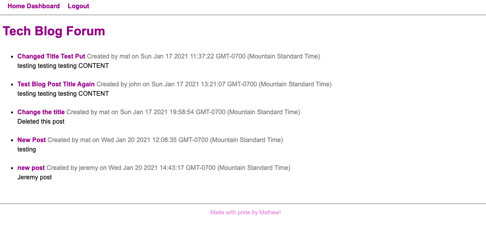

# tech-blog

## Description
  A webpage where users can create a profile and make blog posts off of their profile.
  
  ## Table of Contents:
  * [Description](#description)
  * [Built With](#built-with)
  * [Repository](#repository)
  * [License](#license)

  ## Built With
  JavaScript, Node, HTML, CSS, Express, Handlebars, Sequelize, MySql2, JawsDB, Heroku, express

  ## Repository
  [Repository Link](https://github.com/Mbogaert/tech-blog)

  ## Heroku
  [Heroku Link](https://aqueous-escarpment-47432.herokuapp.com/)

  ## Screenshot
  

  ## Contributions
  Made with Pride by Mathew Bogaert

  ## License
  This application is unlicensed.